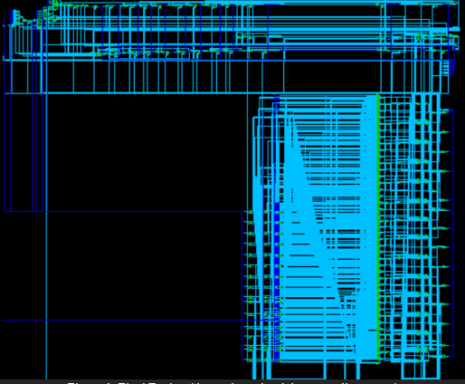

# All-Binary Convolutional Neural Net Accelerator

## Description

A Verilog 2001 implementation of one stage of an all-binary convolutional neural net. The design computes the convolution of a 3x3 kernel over a 10x10, 12x12, or 16x16 matrix in parallel. Input examples are fed to the module from non-synthesized SRAMs and the outputs are written to an independent SRAM.

## Technical Notes

For more information on the design, refer to the attached pdf.

## Notes

- This repo houses all the code for the class project in ECE 564 (ASIC and FPGA Design with Verilog) at NCSU
- The synthesis scripts are not original and are from a template
- I am not responsible for improper use of this code and do not condone its use in any coursework.
